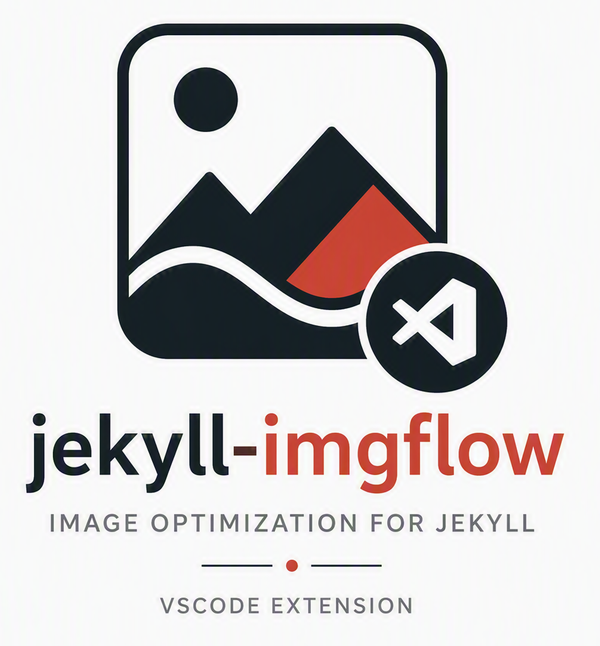

# Jekyll ImgFlow — VS Code companion



[](https://open-vsx.org/extension/gundestrup/jekyll-imgflow)
[](https://open-vsx.org/extension/gundestrup/jekyll-imgflow)
[](LICENSE)
[](https://deepwiki.com/gundestrup/jekyll-imgflow-vscode)

A Visual Studio Code companion for [jekyll-imgflow](https://github.com/gundestrup/jekyll-imgflow). It provides image filename autocomplete inside `` Liquid tags in Markdown and Liquid files.

## Installation

Install from [Open VSX](https://open-vsx.org/extension/gundestrup/jekyll-imgflow) (for [VSCodium](https://vscodium.com/) or any Open VSX-compatible editor) or download the latest `.vsix` from [GitHub Releases](https://github.com/gundestrup/jekyll-imgflow-vscode/releases) and run:

```bash
code: --install-extension jekyll-imgflow-0.1.2.vsix
```

## Features

- Auto-discovers the `imgflow.originals` path from `_config.yml`
- Suggests image names as you type `{% imgflow ` ...
- Watches the originals directory for new, deleted, or renamed files
- Works alongside any Liquid/Jekyll syntax extension

## Usage

```liquid

```

Place the cursor after `{% imgflow ` and VS Code will suggest available image names from your `imgflow.originals` directory.

## Configuration

| Setting | Description |
|---|---|
| `jekyllImgFlow.originals` | Override the `imgflow.originals` directory. Can be a string or an array of strings. |
| `jekyllImgFlow.formats` | File extensions to include in suggestions. |

## Requirements

- A Jekyll site using [jekyll-imgflow](https://github.com/gundestrup/jekyll-imgflow)
- `_config.yml` containing an `imgflow:` block with `originals:`

## License

AGPL-3.0-or-later — see [LICENSE](LICENSE).
