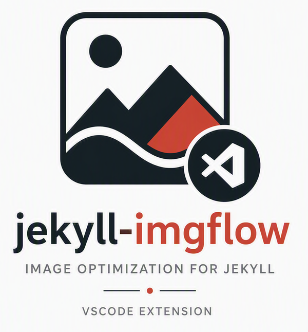

# Jekyll ImgFlow — VS Code companion

[](https://codecov.io/gh/gundestrup/jekyll-imgflow-vscode)




[](https://github.com/gundestrup/jekyll-imgflow-vscode/actions/workflows/ci.yml)
[](https://open-vsx.org/extension/gundestrup/jekyll-imgflow)
[](https://open-vsx.org/extension/gundestrup/jekyll-imgflow)
[](LICENSE)
[](https://deepwiki.com/gundestrup/jekyll-imgflow-vscode)
[](https://github.com/gundestrup/jekyll-imgflow-vscode/actions/workflows/ci.yml)
[](https://www.codefactor.io/repository/github/gundestrup/jekyll-imgflow-vscode)
[](https://sonarcloud.io/summary/new_code?id=gundestrup_jekyll-imgflow-vscode)

A Visual Studio Code companion for [jekyll-imgflow](https://github.com/gundestrup/jekyll-imgflow), [jekyll-documents](https://github.com/gundestrup/jekyll-documents), and [jekyll-icon-flow](https://github.com/gundestrup/jekyll-icon-flow). It provides autocomplete for ImgFlow images, document references, and icons inside Liquid tags in Markdown and Liquid files.

## Installation

Install from [Open VSX](https://open-vsx.org/extension/gundestrup/jekyll-imgflow) (for [VSCodium](https://vscodium.com/) or any Open VSX-compatible editor) or download the latest `.vsix` from [GitHub Releases](https://github.com/gundestrup/jekyll-imgflow-vscode/releases) and run:

```bash
code --install-extension jekyll-imgflow-0.1.4.vsix
```

## Features

- Auto-discovers ImgFlow, Documents, and Icon Flow paths from `_config.yml`
- Suggests image names as you type after an `` tag
- Completes ImgFlow parameters: sizes (`width:`/`height:`/`ratio:`/`aspect_ratio:`), formats, `quality:`, `preset:`, crop/watermark options, HTML attributes (`alt:`/`class:`/`title:`/`loading:`), `link:`, `modal:`, and `markup:` output formats
- Suggests document titles in `` and mapped categories in ``
- Completes document tag parameters (`text:`, `icon:`, `size:`, `list:`, `limit:`, `aggregate:`, `path:`) and suggests real document/category paths as `path:`/`category:` values — also covers `` (`alt:`/`class:`) and `` (`count:`/`category:`)
- Inserts exact `path:` references when duplicate document titles or category names need disambiguation
- Suggests icon names in ``, ``, ``, and `` tags — the list follows the configured `icon_flow.pack`, the tag's bound pack, and the `icon_flow.registry` keys
- Completes icon tag parameters: named sizes (`size:xxs`…`size:xxl`, all relative to the text line), `class:`, `title:`, and `pack:` on the generic `` tag
- Custom icons are indexed live from `icon_flow.custom_dir`; bundled lucide/simple-icons names come from the installed gem (or a built-in list matching the current release)
- Watches configured source directories and refreshes when files or configuration change
- Works alongside any Liquid/Jekyll syntax extension

## Usage

```liquid





```

Place the cursor in the first argument of a supported tag. ImgFlow suggestions come from `imgflow.originals`; document titles and categories come from the configured `documents.root` source tree; icon names come from the installed jekyll-icon-flow packs and `icon_flow.custom_dir`.

## Configuration

|Setting|Description|
|---|---|
| `jekyllImgFlow.originals` | Override the `imgflow.originals` directory. Can be a string or an array of strings. |
| `jekyllImgFlow.formats` | File extensions to include in suggestions. |

## Requirements

- A Jekyll site using [jekyll-imgflow](https://github.com/gundestrup/jekyll-imgflow), [jekyll-documents](https://github.com/gundestrup/jekyll-documents), [jekyll-icon-flow](https://github.com/gundestrup/jekyll-icon-flow), or any combination
- An `_config.yml`; omitted plugin options use the gems' default source paths

## License

AGPL-3.0-or-later — see [LICENSE](LICENSE).
